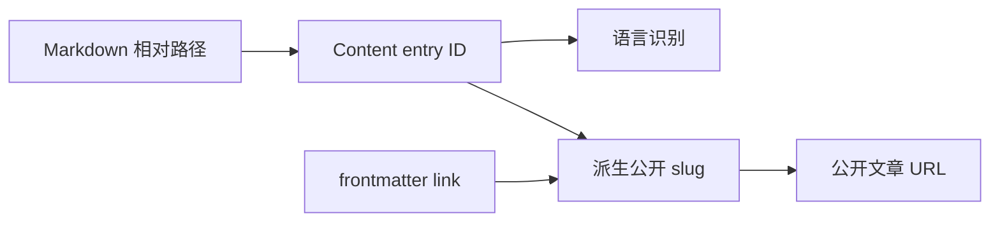

这次升级看起来只是把 `astro` 从 5.16.6 改成 6.x，实际却穿过了内容身份、Markdown 编译、Vite
预渲染、RSS 和第三方 integration 五条链路。更麻烦的是，astro-koharu 不是只有一个模板仓库：每位用户都有自己的
文章、永久链接、历史备份和生成资产。模板能构建，不等于用户升级后不会丢 URL，也不等于恢复一份旧备份后仍能构建。

因此，真正困难的不是让 `pnpm build` 变绿，而是同时证明两件事：升级前后的 URL、多语言 fallback、搜索索引和文章
HTML 没有悄悄改变；一份长期使用的下游仓库也能通过同一套工具安全迁移，而不需要用户逐篇修改 frontmatter。

本文记录的是 astro-koharu 的真实迁移结果。最终版本为 Astro 6.4.8，没有启用 Content Collections legacy
兼容开关，也没有把实验特性留在生产配置中。迁移最终还补上了一条可 dry-run、自动备份且幂等的内容迁移命令，并用
376 篇真实历史文章的完整备份恢复验证了这条路径。

## 先定义成功，而不是先改版本号

[Astro 6 升级指南](https://docs.astro.build/en/guides/upgrade-to/v6/)要求 Node.js 22.12+，并伴随 Zod 4、
Shiki 4 及 Vite 7 构建管线的变化。迁移时 npm 的 `astro@latest` 已经进入 7.x，因此不能无版本约束地运行升级命令。
本次把 Astro 精确锁定在 `6.4.8`，同时把 Node 边界和 pnpm 版本落到 `package.json`：

```json
{
  "packageManager": "pnpm@10.28.2",
  "engines": {
    "node": ">=22.12.0"
  },
  "dependencies": {
    "astro": "6.4.8"
  }
}
```

精确版本不只是为了重现本次构建。Koharu 的新版更新流程也会读取 `packageManager`，并用声明的
pnpm 精确版本安装依赖，避免更新到新 lockfile 后又意外回落到调用者机器上的旧 pnpm。

迁移前先保存了一组可比较的基线：

| 指标 | Astro 5.16.6 基线 |
|---|---:|
| `astro check` | 347 个文件，0 error / warning / hint |
| Astro 静态页面 | 130 |
| Pagefind 索引页面 | 134 |
| `dist/` 路由产物 | 141 |
| Astro 报告的构建耗时 | 约 21.62 秒 |

成功标准不只是页面数相等，还包括四类不变式：

- 默认语言 URL 不带前缀，英文和日文继续使用 `/en/`、`/ja/`；
- frontmatter 的 `link` 仍然可以覆盖公开 slug，未翻译页面的 canonical 仍指向默认语言；
- GFM、Shiki、KaTeX、Mermaid、Pagefind、RSS、sitemap 和 robots 继续生成。
- 历史文章迁移前后保留相同公开 URL，旧备份恢复后不会混入新版模板自带的示例内容。

Fonts API、CSP、Live Content Collections、Rust compiler 和 queued rendering 都不在兼容迁移范围内。把新功能与
major upgrade 混在一起，会让故障定位和回滚都变得困难。

## 依赖升级不是全部追最新

核心依赖最终落在以下版本：

| 依赖 | 迁移前 | 迁移后 |
|---|---:|---:|
| `astro` | 5.16.6 | 6.4.8 |
| `@astrojs/react` | 4.4.2 | 5.0.7 |
| `@astrojs/sitemap` | 3.7.0 | 3.7.3 |
| `@astrojs/rss` | 4.0.14 | 4.0.19 |
| `shiki` | 3.22.0 | 4.3.1 |
| `astro-mermaid` | 1.2.0 | 2.1.0 |
| `astro-pagefind` | 1.8.5 | 1.8.6 |
| `astro-loading-indicator` | 0.7.1 | 0.9.0 |

这里最反直觉的是 `astro-pagefind`。2.x 的确支持 Astro 6，但它同时把原来的搜索组件改成了 Web Component API。
直接升级会迫使现有搜索样式、键盘导航和本地化一起重写。1.8.6 已补上 Astro 6 peer 支持，又保留旧 UI，所以它才是
这次兼容迁移的合理目标。

迁移的原则由此变得很明确：优先选择支持新框架且不扩大产品行为变化的最小版本，而不是把所有包机械地升到最新 major。

## 最核心的变化：Content Layer 身份模型

Astro 5 的旧内容配置位于 `src/content/config.ts`，业务代码还在读取 `post.slug` 并调用 `post.render()`。
[Astro Content Collections 文档](https://docs.astro.build/en/guides/content-collections/)给出的新模型则要求显式 loader，
内容配置移到 `src/content.config.ts`，Zod 从 `astro/zod` 导入：

```typescript
import { defineCollection } from 'astro:content';
import { glob } from 'astro/loaders';
import { z } from 'astro/zod';

const blogCollection = defineCollection({
  loader: glob({
    pattern: '**/[^_]*.{md,mdx}',
    base: './src/content/blog',
  }),
  schema: z.object({
    title: z.string(),
    // Other frontmatter fields...
  }),
});
```

真正需要保护的是“内部 ID”和“公开 slug”之间的边界：



例如 `en/tools/getting-started.md` 的内容 ID 是 `en/tools/getting-started`，但公开 URL 还要先移除 locale，
再考虑 `link` override 和字符转写。项目里其他 DTO 也有名为 `slug` 的字段，却表达公开路径；如果全仓替换
`slug` 为 `id`，搜索、相似文章和系列导航都会被破坏。

所以迁移只替换 `CollectionEntry<'blog'>` 的身份读取：

```typescript
export function getPostLocale(post: BlogPost): string {
  return getSlugLocaleInfo(post.id).locale;
}

export function getPostSlug(post: BlogPost): string {
  return post.data.link ?? transliterateSlug(getSlugLocaleInfo(post.id).localeFreeSlug);
}
```

路由也不再把整个 entry 当成旧式可渲染对象，而是传递内部 ID，再使用新的顶层 `render()`：

```typescript
import { render } from 'astro:content';

return posts.map((post) => ({
  params: { slug: getPostSlug(post) },
  props: { postId: post.id },
}));

const post = await getPostById(postId, locale);
if (!post) throw new Error(`Post not found: ${postId}`);
const { Content } = await render(post);
```

Astro 6 的 `body` 类型允许为 `undefined`，因此摘要和纯文本提取还需要显式兜底：

```typescript
extractTextFromMarkdown(post.body ?? '', maxLength);
```

这不是为了掩盖缺失内容，而是因为集合还可能包含没有 Markdown body 的 entry；调用纯文本工具时应把该状态转换成空输入。

### 为什么旧文章里的 `slug` 不能原样留下

`glob()` loader 会用文件路径建立稳定的 entry ID，而旧内容里的顶层 `slug` 又承载过自定义永久链接语义。继续让同一个字段
横跨两套身份模型，最危险的结果不是立刻报错，而是文章仍能生成、公开 URL 却变了。

因此，新 schema 只把 `link` 视为显式的公开 URL override。旧 `slug` 不能简单删除，因为它可能是用户长期对外分享的地址；
也不能继续当成普通 frontmatter 原样保留。正确迁移必须先确定它过去代表的公开 URL，再把这层语义转移到 `link`。

## 历史文章不能靠用户手工迁移

模板仓库里的示例文章很整齐，真实用户仓库却可能跨过多个版本：有些文章只有 `link`，有些还保留 `slug`，有些从未显式写过
永久链接，多语言对应文章也未必在同一时间创建。让用户做一次全局替换，既无法处理这些分支，也无法发现两篇文章即将撞到
同一个 URL。

为此，Koharu CLI 增加了专门的迁移入口：

```bash
# 只扫描并展示计划，不写文件
pnpm koharu migrate --dry-run

# 确认计划后，自动备份并执行
pnpm koharu migrate
```

对从旧版 astro-koharu 升级的用户，实际入口仍然是更新前已经存在的旧 CLI。完整顺序是：

```bash
# 先由旧 CLI 完成备份、拉取、合并和依赖安装
pnpm koharu update

# 等上面的进程完全退出，再使用更新后的 CLI
pnpm koharu migrate --dry-run
pnpm koharu migrate
```

这个边界很重要：正在运行的 `update` 进程加载的仍是升级前的代码，不能假设它已经拥有更新后才出现的
`migrate` 子命令。等旧进程退出后重新调用 CLI，才能确保执行的是新版迁移逻辑。

迁移策略不是“所有文章都加一个新字段”，而是按已有数据选择最小改动：

| 文章现状 | 迁移动作 | URL 结果 |
|---|---|---|
| 只有 `link` | 不修改 | 完全保持现状 |
| 同时有 `link` 和 `slug` | 保留 `link`，移除冗余 `slug` | 继续以原 `link` 为准 |
| 只有 `slug` | 原位把字段名改为 `link` | 精确保留旧 permalink |
| 两者都没有 | 默认语言使用路径；非默认语言优先跟随默认语言链接，缺少默认语言对应文章时才复用其他译文的唯一 `link`，否则使用路径 | 默认语言 URL 保持不变，译文尽量保持配对 |
| 同语言链接重复，或缺少默认语言对应文章且其他译文给出多个候选 `link` | 报错并阻止整批写入 | 不猜测、不产生半套 URL |

这里有几个容易忽略的安全细节：

- 扫描覆盖所有 `.md` 与 `.mdx`，不是只处理模板当前使用的目录层级；
- 修改是针对顶层字段的局部编辑，不重新序列化整份 YAML，避免无意义地重排用户 frontmatter；
- 任何解析错误、空链接或同语言 URL 冲突都会在写入前让整批迁移停止；
- 博客内容只接受普通文件，遇到符号链接会直接阻止，避免跟随到内容目录外部；
- 正式写入前会再次确认全部源文件、站点配置和文件集合与扫描时完全相同，避免用户并行编辑导致计划过期；
- 单文件通过同目录临时文件和原子 rename 写入，保留原权限；后续写入失败时，已安装的变更会按逆序回滚；
- 执行前自动创建基础备份；再次运行 dry-run 应得到 0 项变更，幂等性本身也是验收条件。

为了防止用户跳过这一步，`pnpm dev` 和 `pnpm build` 现在都会先运行 `pnpm koharu migrate --check`。
这个模式只读扫描，不会自动改文章；发现待迁移项或无法安全处理的 frontmatter 时会以非零状态退出，
在 Astro 启动或构建前给出 dry-run 和正式迁移指引。

多语言配对尤其不能只看文件名。假设默认语言文章已经把 `note/old-name` 定制为 `my-stable-url`，而英文对应文章没有
`link`。如果英文文章机械地使用自身路径，它会与默认语言失去同一公开 slug。因此，非默认语言文章会优先跟随默认语言文章的
稳定链接；只有缺少默认语言对应文章时，才会复用其他译文的唯一候选，候选互相矛盾时宁可让用户决定。反过来，默认语言文章
没有显式链接时，路径本身就是已有的公开 URL，不能被译文的自定义链接覆盖，其他缺少链接的译文也应继续跟随这条路径。

旧的 `pnpm save-slugs` 仍保留为兼容入口，但新用户只需要记住 `pnpm koharu migrate`。这样迁移规则、备份流程和 CLI
反馈位于同一个入口，后续再增加数据版本也不必继续堆一次性脚本。

## 恢复旧备份不能只是 `cp -r`

内容字段迁完之后，还有一个更隐蔽的问题：旧恢复逻辑是把备份目录复制进新版本目录。如果新模板增加了一篇示例文章，而用户的
旧备份里没有它，普通目录合并会把这篇文章留下。对文件系统来说这是“合并成功”，对用户来说却是恢复后凭空多出了一篇文章。

这说明备份恢复需要区分“用户快照”和“可向前合并的配置”，不能对所有目录使用同一种复制语义：

| 恢复对象 | 恢复语义 | 原因 |
|---|---|---|
| `src/content/blog` | 先清理目标，再恢复快照 | 文章集合必须与备份时完全一致 |
| `public/img` | 先清理目标，再恢复快照 | 避免已删除的用户图片残留 |
| `src/pages/*.md` | 只替换根目录下的独立 Markdown 页面 | 删除旧自定义页面，同时保留新版 `.astro` 路由 |
| `config/` | 合并恢复 | 还原用户配置，但保留新版新增的主题配置文件 |
| summaries、similarities、LQIP | 完整备份恢复；基础备份不包含 | 这些资产必须与文章快照配套 |

新备份 manifest 增加 `schemaVersion: 2`，但缺少该字段的历史归档仍按 v1 读取。对“独立 Markdown 页面为空”的情况，
备份也会保留空目录标记，让恢复器能区分“用户当时确实没有独立页面”和“这类数据根本不在旧归档中”。前者应该清掉现有
Markdown 页面，后者则不应贸然删除任何东西。

恢复前不只检查扩展名和 `manifest.json`。CLI 会校验备份路径、manifest schema、声明的恢复项与归档实际内容，
拒绝符号链接、未声明条目和文件/目录类型不匹配。校验和解压使用同一份只读私有快照，避免原归档在两步之间被替换。
解压后也不会立即覆盖用户目录：恢复器会先在项目内准备候选快照、运行内容迁移，全部通过后再事务性切换；中途提交失败则回滚已切换的目标。

只要恢复项包含博客内容，恢复器就会紧接着执行同一套内容迁移。升级流程若发现无法自动处理的冲突，会中止 clean update 并
进入原有回滚路径，而不是带着半迁移内容继续构建。基础备份恢复后，CLI 还会明确提示运行：

```bash
pnpm koharu generate all
```

这是因为基础备份只保护源数据与配置，不包含 AI 摘要、相似文章和 LQIP 等派生资产；完整备份才会携带与该内容快照配套的
生成结果。

## 四个只在真实构建里暴露的问题

### 1. Markdown 插件配置开始弃用

原配置把 `gfm`、`remarkPlugins` 和 `rehypePlugins` 直接挂在 `markdown` 下。Astro 6.4 会对此发出弃用提示。
项目的 Markdown 管线包含 Shoka 语法、链接嵌入、Mermaid、KaTeX 和代码块 transformer，不能简单删除，于是改为显式
创建 unified processor：

```javascript
import { unified } from '@astrojs/markdown-remark';

markdown: {
  processor: unified({
    gfm: true,
    remarkPlugins,
    rehypePlugins,
  }),
  syntaxHighlight: {
    type: 'shiki',
    excludeLangs: ['mermaid'],
  },
}
```

这样既消除了弃用路径，又保留 Astro 对 Shiki 4 的处理。

### 2. `react-tweet` 在预渲染环境里无法加载 CSS

升级后的首次生产构建报错：

```text
Unknown file extension ".css"
Hint: add the package to vite.resolve.noExternal
```

旧配置中的 `vite.ssr.noExternal` 没有覆盖 Astro 6 的预渲染 environment。按照错误提示改成顶层
`vite.resolve.noExternal` 后，`react-tweet` 的 CSS 才重新进入 Vite 转换链：

```javascript
vite: {
  resolve: {
    noExternal: ['react-tweet'],
  },
}
```

### 3. RSS 的旧 patch 版本不兼容 Zod 4

`@astrojs/rss` 4.0.14 在 Astro 6 下抛出：

```text
z.function(...).returns is not a function
```

问题不是 RSS 数据，而是该版本仍调用 Zod 4 已移除的 API。升级到 4.0.19 后，默认、英文和日文三份 feed 都恢复生成。

### 4. i18n 配置描述了一个实际不存在的重定向

项目原来同时配置 `prefixDefaultLocale: false` 和 `redirectToDefaultLocale: true`。Astro 6 不再接受这个组合；更重要的是，
Astro 5 基线里 `/zh/` 和 `/zh/post/*` 本来就是 404，并没有真实重定向行为可以保留。

最终删除无效选项，同时更新代码注释。规范 feed URL 仍是 `/rss.xml`、`/en/rss.xml` 和 `/ja/rss.xml`；即使 preview
目前还能访问 `/rss.xml/`，也不再把尾斜杠版本当作兼容契约。

## 怎样证明公开行为没有漂移

### 先验证模板公开行为

最终普通构建的结果如下。路由产物集合比较发生在加入本文之前，避免新文章本身干扰迁移前后对比。

| 指标 | Astro 5 | Astro 6 | 结论 |
|---|---:|---:|---|
| 静态页面 | 130 | 130 | 一致 |
| Pagefind 索引页面 | 134 | 134 | 一致 |
| `dist/` 路由产物 | 141 | 141 | 无新增、无丢失 |
| Astro 构建耗时 | 21.62s | 21.76s | 接近基线 |

除了 `pnpm lint`、`pnpm check`、`pnpm build` 和 `git diff --check`，还做了这些输出级验证：

- `/`、`/en/`、`/ja/`，以及默认语言和本地化文章均返回 200；`/zh/` 保持 404；
- 未翻译文章的英文 fallback 页面仍显示默认语言正文，canonical 指回默认语言 URL；
- 代表性文章产物同时包含 Pagefind body、Shiki、KaTeX 和 Mermaid 标记；
- Pagefind 对 `Astro` 的实际查询返回 8 条结果，首条仍是 `/post/getting-started/`；
- 三份 RSS 都返回 `text/xml`，sitemap 和 robots 正常生成；
- pnpm 10.28.2 使用 frozen lockfile 的干净依赖层安装成功，Astro 补丁确认生效，宿主机生产构建成功；验证环境的
  Docker daemon 不可用，因此没有把完整镜像构建写成已验证项。

浏览器自动化环境当时没有可用的浏览器实例，因此没有把 ClientRouter 点击、搜索键盘操作写成“已自动化通过”。这里宁可明确
验证边界，也不要把 HTML 和 HTTP 检查冒充完整的浏览器交互测试。

构建仍会出现 `infographic` 语言回退、一个外部知乎链接 403 和大 chunk 提示；它们在 Astro 5 基线中已经存在，
不属于本次升级回归。

当前分支加入本文及迁移配套内容后，最终 Astro 6 构建生成 151 个静态页面，Pagefind 索引 155 个页面；这个数字用于确认
最终交付状态能完整构建，不应拿来与加入新内容前的 130 / 134 基线直接比较。相似度资产覆盖全部 12 个默认语言条目，每项
保留 5 个引用，且没有指向不存在文章的悬空引用。

### 再验证迁移脚本，而不只验证 happy path

模板当前有 21 篇 Markdown / MDX 内容。首次正式迁移处理了其中 2 篇没有 `link` 的旧示例文章；随后再次执行
`pnpm koharu migrate --dry-run`，结果是扫描 21 篇、待迁移 0 篇、错误 0 个。

自动化测试则刻意覆盖更危险的分支：

| 测试场景 | 关键断言 |
|---|---|
| 混合 `link` / `slug` / 空字段及多语言对应文章 | URL 保留，译文复用稳定链接，第二次运行无变更 |
| 重复链接、危险 frontmatter、符号链接和并发改动 | 整批不写入，已开始的原子写入可回滚 |
| 缺失或不一致的 manifest、恶意归档条目和恢复提交失败 | 预览前拒绝非法归档，事务提交失败时恢复旧目标 |
| 把旧归档恢复到已有新模板内容的目录 | 旧快照精确替换、恢复后自动迁移，同时保留新版 Astro 路由与配置 |
| 跨版本更新、新版 `--check` 与 pnpm 版本锁定 | 命令行参数不串命令，依赖安装只使用明确的 pnpm 版本 |

这些分支由 Node 内置 test runner 执行，统一放在 `pnpm test:migrate` 中；当前共 42 个测试。
它们验证的是数据不变式、归档边界和进程退出契约，而不是 CLI 文案，因此即使以后替换终端 UI，迁移的核心行为仍然有保护。

### 最后用真实下游仓库做完整恢复

只拿几篇 fixture 证明脚本可用仍然不够。实际验证选了一份从 astro-koharu v4.2.1 长期演进而来的个人仓库，在不修改源仓库的
前提下读取它的完整备份，并恢复到一个临时 Astro 6 副本：

| 检查项 | 结果 |
|---|---:|
| 历史 Markdown / MDX | 376 篇 |
| 已有稳定 `link` | 375 篇 |
| 需要自动补齐 | 1 篇 |
| 同语言 URL 冲突 | 0 |
| 恢复后的内容数量 | 376 篇 |
| `astro check` | 0 error / warning / hint |
| Astro 6 静态页面 | 797 |
| Pagefind 索引页面 | 801 |

这个测试同时验证了两个容易漏掉的点。第一，临时副本中由新版模板自带、但不在旧快照里的示例文章没有残留，证明博客目录执行的
确实是快照替换，而不是目录合并。第二，恢复后只有 1 篇文章被自动补齐 `link`，另外 375 篇的 metadata 和正文不需要重写。
迁移前后的源仓库 Git 状态保持干净，验证产物和临时归档也在结束后删除。

历史内容构建仍出现少量 KaTeX Unicode、未知 Shiki 语言别名和外部链接抓取失败提示。这些 warning 来自旧文章本身，既没有
造成 Astro 6 类型诊断，也没有阻止 797 个页面完成生产构建，因此应该记录和后续治理，但不能误判成数据迁移失败。

## 哪些 Astro 6 能力值得顺手开启

答案比预想中保守：只接受 Astro 6 默认带来的新 dev/build pipeline。

- **Fonts API**：稳定且值得单独研究，但项目已有约 20 MB 中日文字体分片、按 locale 加载和阅读器字体设置，不是零成本替换；
- **CSP**：当前与 ClientRouter、Shiki 以及多种 inline/第三方资源冲突，本轮不启用；
- **Live Content Collections / route caching**：面向按需渲染，与 static + nginx 架构不匹配；
- **Sonda**：继续保留 `ANALYZE=true pnpm build` 的按需模式，不增加日常构建成本。

Rust compiler 和 queued rendering 看似只需要一行配置，所以额外做了同机单次构建实验。它不是严格性能测试，但足以决定
是否值得把实验配置留在主干：

| 模式 | real time | Astro time | 最大 RSS | 相对默认 |
|---|---:|---:|---:|---:|
| 默认 | 25.29s | 22.89s | 2.30 GB | 基线 |
| queued rendering | 26.60s | 24.48s | 2.36 GB | 约慢 5.2% |
| Rust compiler 0.3.1 | 26.24s | 23.66s | 2.47 GB | 约慢 3.8% |

两项实验在这套内容和机器上都没有收益，相关配置与 `@astrojs/compiler-rs` 依赖随后全部移除。

## 一份可复用的迁移顺序

如果你的 Astro 项目也有复杂内容层，可以按下面的顺序降低排障噪声：

1. 固定迁移前 Node、check、build、路由和代表性 HTML 基线；
2. 显式锁定目标 major，不使用会跨 major 的 `latest`；
3. 先升级 Astro 和官方 integrations，记录第一批真实错误；
4. 单独迁移 `content.config.ts`、loader、`entry.id` 和 `render(entry)`；
5. 区分内部内容 ID、公开 slug 与 frontmatter override，避免机械替换；
6. 先对下游历史文章 dry-run，发现冲突时整批停止，不让用户手工批量改 frontmatter；
7. 把正式迁移放在自动备份之后，并用第二次 dry-run 证明它是幂等的；
8. 明确旧备份中哪些目录是快照替换、哪些配置需要向前合并，恢复内容后自动执行同一迁移；
9. 逐个验证 Markdown、搜索、RSS、sitemap 和第三方 integrations；
10. 比较路由集合，再检查 fallback canonical 和生成 HTML；
11. 用至少一份真实下游备份做临时恢复、check 和生产构建；
12. 最后才评估实验能力，并保证实验依赖不进入生产 lockfile。

astro-koharu 用户从旧版升级时，先运行 `pnpm koharu update` 并等进程完全退出，再用
`pnpm koharu migrate --dry-run` 查看计划，最后运行 `pnpm koharu migrate` 自动备份并执行。已有 `link` 会保留，
旧 `slug` 会转换为 `link`，旧备份通过 Koharu CLI 恢复后也会自动执行同一迁移。如果忘记手动迁移，
`pnpm dev` 和 `pnpm build` 的只读检查会阻止旧内容进入 Astro 6 管线，但不会替用户改写文章。

## 总结

这次迁移最后没有留下兼容 flag，也没有改变静态部署架构。最大的收获不是版本号从 5 变成 6，而是把内容身份和数据升级的
边界写清楚：`entry.id` 负责内部查找，公开 slug 负责 URL，`link` 只覆盖后者；备份中的文章和图片是用户快照，配置则需要在
恢复用户值的同时接住新版本能力。这个模型一旦明确，多语言 fallback、搜索、RSS 和旧备份恢复就有了共同依据。

major upgrade 最可靠的完成标准也不是“模板构建成功”，而是能回答三个问题：哪些行为必须保持、历史数据如何安全过桥、
哪些结论有可重复的证据。版本升级只是代码改动；当一份真实的 376 篇文章备份也能无损恢复并完成生产构建，这次迁移才真正
覆盖到了用户。
